> 杭州电子科技大学考研信息、资料汇总   by 张大炮
>
> GitHub Pages:[杭州电子科技大学计算机考研信息汇总](https://ztygalaxy.github.io/Hello_HDU)
>
> 适用报考范围：  **计算机学院计算机相关专业**  

**前言**：什么他娘的精锐，老子打的就是精锐！——李云龙

## 已更新目录

- [初试篇](#初试篇)
    - [1  杭电考研重要网站](#1--杭电考研重要网站)
    - [2  招生专业目录](#2--招生专业目录)
        - [2.1  全日制](#21--全日制)
        - [2.2  非全日制](#22--非全日制)
    - [3  报录比](#3--报录比)
        - [3.1  2018年](#31--2018年)
        - [3.2  2017年](#32--2017年)
        - [3.3  2016年](#33--2016年)
    - [4  考试大纲](#4--考试大纲)
        - [4.1  2018年考试大纲](#41--2018年考试大纲)
        - [4.2  2017年考试大纲](#42--2017年考试大纲)
        - [4.3  2016年考试大纲](#43--2016年考试大纲)
    - [5  专业课真题](#5--专业课真题)
        - [5.1  数据结构](#51--数据结构)
        - [5.2  组成原理](#52--组成原理)
        - [5.3  考点统计](#53--考点统计)
    - [6  2018考研经验分享](#6--2018考研经验分享)
- [复试篇](#复试篇)
    - [1  分数线](#1--分数线)
        - [1.1 分数线简介](#11-分数线简介)
        - [1.2  国家线](#12--国家线)
            - [1.2.1  2018年国家线](#121--2018年国家线)
            - [1.2.2  2017年国家线](#122--2017年国家线)
            - [1.2.3  2016年国家线](#123--2016年国家线)
        - [1.3  院线](#13--院线)
            - [1.3.1  2018年计算机学院院线](#131--2018年计算机学院院线)
            - [1.3.2  2017年计算机学院院线](#132--2017年计算机学院院线)
            - [1.3.3  2016年计算机学院院线](#133--2016年计算机学院院线)
        - [1.4 分数分析](#14-分数分析)
            - [1.4.1  2018年复试分数分布](#141--2018年复试分数分布)
            - [1.4.2  2018年录取分数分布](#142--2018年录取分数分布)
    - [2  时间线](#2--时间线)
        - [2.1  2018年复试时间线](#21--2018年复试时间线)
        - [2.2  2017年复试时间线](#22--2017年复试时间线)
        - [2.3  2016年复试时间线](#23--2016年复试时间线)
    - [3  临阵磨枪](#3--临阵磨枪)
        - [3.1  练习](#31--练习)
        - [3.2  部分复试笔试真题及解析](#32--部分复试笔试真题及解析)
    - [4  复试进行时](#4--复试进行时)
        - [4.1  复试安排](#41--复试安排)
        - [4.2  复试所需资料](#42--复试所需资料)
        - [4.3  复试录取办法](#43--复试录取办法)
        - [4.4  杭电平面图](#44--杭电平面图)
        - [4.5  实验室宣传栏](#45--实验室宣传栏)
    - [陆续更新中。。。](#陆续更新中)
- [后记](#后记)
    - [致谢](#致谢)

---

## 初试篇

### 1  杭电考研重要网站

> **简介**：前两个网站请务必及时关注，后两个为专业课资料的出版方论坛。

- [杭州电子科技大学研究生院](http://grs.hdu.edu.cn)
- [杭州电子科技大学计算机学院](http://computer.hdu.edu.cn )
- [天勤论坛](http://www.csbiji.com/)
- [王道论坛](www.cskaoyan.com)

### 2  招生专业目录

> **简介**：招生专业、人数、初试科目等信息。

#### 2.1  全日制

- 2018年计算机学院全日制硕士研究生招生专业目录([下载](https://github.com/ztygalaxy/Hello_HDU/blob/master/Data2019/%E5%85%A8_2019.xls?raw=true))

  

#### 2.2  非全日制

- 2018年计算机学院非全日制硕士研究生招生专业目录([下载](https://github.com/ztygalaxy/Hello_HDU/blob/master/Data2019/%E9%9D%9E%E5%85%A8_2019.xls?raw=true))

  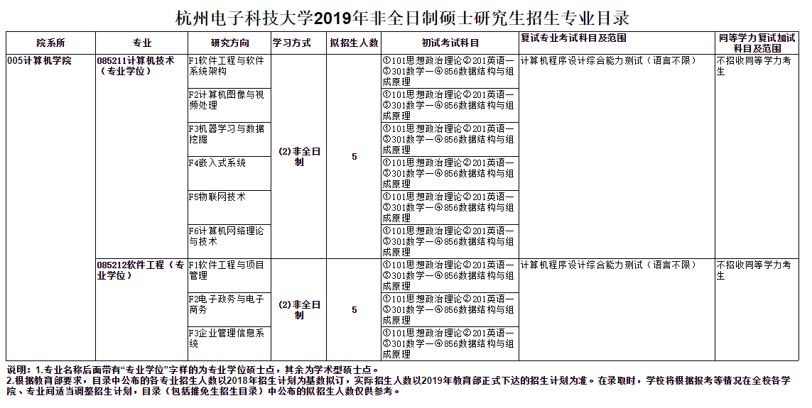
  
### 3  报录比

> **简介**：历年各专业的具体报录信息和往年的考试均分等信息。供考研学子评估考研难度，为择校提供参考数据。列分别为：报名人数/上线人数/复试人数/最高分/最低分/平均分。

#### 3.1  2018年

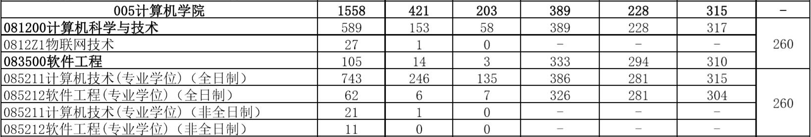

[详情](https://github.com/ztygalaxy/Hello_HDU/blob/master/Data2018/2018%E5%B9%B4%E7%A1%95%E5%A3%AB%E7%A0%94%E7%A9%B6%E7%94%9F%E6%8A%A5%E8%80%83%E4%B8%8A%E7%BA%BF%E5%BD%95%E5%8F%96%E6%83%85%E5%86%B5.pdf)

#### 3.2  2017年
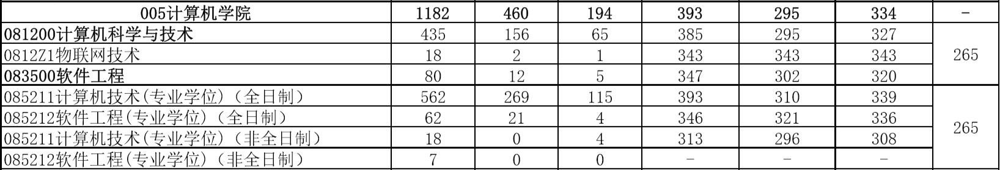

[详情](https://github.com/ztygalaxy/Hello_HDU/blob/master/Data2017/2017%E5%B9%B4%E7%A1%95%E5%A3%AB%E7%A0%94%E7%A9%B6%E7%94%9F%E6%8A%A5%E8%80%83%E4%B8%8A%E7%BA%BF%E5%BD%95%E5%8F%96%E6%83%85%E5%86%B5.pdf)

#### 3.3  2016年

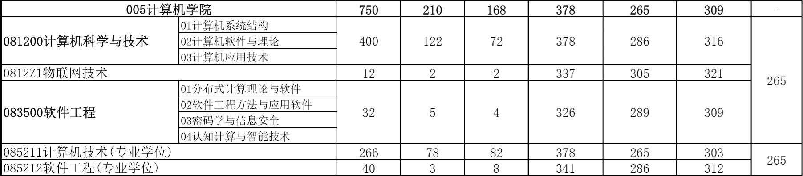

[详情](https://github.com/ztygalaxy/Hello_HDU/blob/master/Data2016/2016%E5%B9%B4%E7%A1%95%E5%A3%AB%E7%A0%94%E7%A9%B6%E7%94%9F%E6%8A%A5%E8%80%83%E4%B8%8A%E7%BA%BF%E5%BD%95%E5%8F%96%E6%83%85%E5%86%B5.pdf)

### 4  考试大纲

> **简介**： 杭电计算机考研一般为数学一、英语一、数据结构与组成原理，学硕专硕考试难度已无差别。
>
> 自2017年12月份数据结构和组成原理合二为一，2018年12月份专硕改为数学一、英语一。据某位老师讲，看考纲切忌经验主义，2018年是个例子。

#### 4.1  2018年考试大纲

[2018年856数据结构与组成原理考试大纲](https://github.com/ztygalaxy/Hello_HDU/blob/master/Data2018/856%E6%95%B0%E6%8D%AE%E7%BB%93%E6%9E%84%E4%B8%8E%E7%BB%84%E6%88%90%E5%8E%9F%E7%90%86.docx?raw=true)

#### 4.2  2017年考试大纲

[2017年851数据结构考试大纲](https://github.com/ztygalaxy/Hello_HDU/blob/master/Data2017/851%E6%95%B0%E6%8D%AE%E7%BB%93%E6%9E%84.doc?raw=true)    [2017年852组成原理考试大纲](https://github.com/ztygalaxy/Hello_HDU/blob/master/Data2017/852%E7%BB%84%E6%88%90%E5%8E%9F%E7%90%86.doc?raw=true)

#### 4.3  2016年考试大纲

[2016年851数据结构考试大纲]()    [2016年852组成原理考试大纲]()

### 5  专业课真题

> **简介**：本栏专业课真题来源于杭电研究生院官网。2018.12第一次将数据结构与组成原理作为一起考试内容。

#### 5.1  数据结构

[2018.12](Data2018/数据结构与组成原理)  [2017.12](Data2017/数据结构)  [2016.12](Data2016/数据结构)  [2015.12](Data2015/数据结构)
[2014.12](Data2014/数据结构)  [2013.12](Data2013/数据结构)  [2012.12](Data2012/数据结构)  [2011.12](Data2011/数据结构)

[历年真题整合]()

#### 5.2  组成原理

[2017.12](Data2017/组成原理)  [2016.12](Data2016/组成原理)  [2015.12](Data2015/组成原理)  [2014.12](Data2014/组成原理)

[2013.12](Data2013/计算机组成原理)  [2012.12](Data2012/计算机组成原理)  [2011.12](Data2011/计算机组成原理)

[历年真题整合]()

#### 5.3  考点统计

> 本数据来自 19HDU计算机考研群

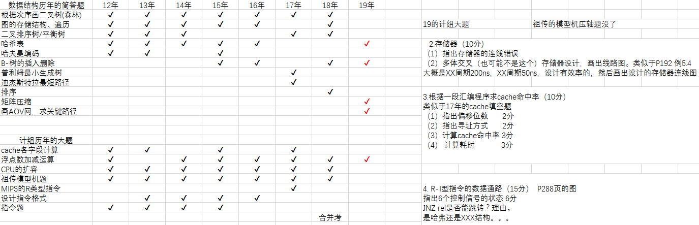

### 6  2018考研经验分享

> **简介**：本栏数据为2018级录取结束后，新生群主管理员等邀请得分高手撰写。作者主要是初试高分选手、复试佼佼者及有特点的选手。

- [18砥砺前行19金榜题名](https://github.com/ztygalaxy/Hello_HDU/blob/master/Others/%E7%BB%8F%E9%AA%8C/18%E7%A0%A5%E7%A0%BA%E5%89%8D%E8%A1%8C19%E9%87%91%E6%A6%9C%E9%A2%98%E5%90%8D.pdf)

- [18杭电计算机考研初试状元经验分享](https://github.com/ztygalaxy/Hello_HDU/blob/master/Others/%E7%BB%8F%E9%AA%8C/18%E6%9D%AD%E7%94%B5%E8%AE%A1%E7%AE%97%E6%9C%BA%E8%80%83%E7%A0%94%E5%88%9D%E8%AF%95%E7%8A%B6%E5%85%83%E7%BB%8F%E9%AA%8C%E5%88%86%E4%BA%AB.pdf)

- [18计算机专业课复习心得](https://github.com/ztygalaxy/Hello_HDU/blob/master/Others/%E7%BB%8F%E9%AA%8C/18%E8%AE%A1%E7%AE%97%E6%9C%BA%E4%B8%93%E4%B8%9A%E8%AF%BE%E5%A4%8D%E4%B9%A0%E5%BF%83%E5%BE%97.pdf)

- [19届复习建议——必看！](https://github.com/ztygalaxy/Hello_HDU/blob/master/Others/%E7%BB%8F%E9%AA%8C/19%E5%B1%8A%E5%A4%8D%E4%B9%A0%E5%BB%BA%E8%AE%AE%E2%80%94%E2%80%94%E5%BF%85%E7%9C%8B%EF%BC%81.pdf)

- [2018复试经验](https://github.com/ztygalaxy/Hello_HDU/blob/master/Others/%E7%BB%8F%E9%AA%8C/2018%E5%A4%8D%E8%AF%95%E7%BB%8F%E9%AA%8C.pdf)

- [不考400分，咱先上国家线！](https://github.com/ztygalaxy/Hello_HDU/blob/master/Others/%E7%BB%8F%E9%AA%8C/%E4%B8%8D%E8%80%83400%E5%88%86%EF%BC%8C%E5%92%B1%E5%85%88%E4%B8%8A%E5%9B%BD%E5%AE%B6%E7%BA%BF%EF%BC%81.pdf)

- [复试大佬经验谈](https://github.com/ztygalaxy/Hello_HDU/blob/master/Others/%E7%BB%8F%E9%AA%8C/%E5%A4%8D%E8%AF%95%E5%A4%A7%E4%BD%AC%E7%BB%8F%E9%AA%8C%E8%B0%88.pdf)

- [杭电学硕大佬复试经验](https://github.com/ztygalaxy/Hello_HDU/blob/master/Others/%E7%BB%8F%E9%AA%8C/%E6%9D%AD%E7%94%B5%E5%AD%A6%E7%A1%95%E5%A4%A7%E4%BD%AC%E5%A4%8D%E8%AF%95%E7%BB%8F%E9%AA%8C.pdf)

- [跨考+英语+面试口语经验](https://github.com/ztygalaxy/Hello_HDU/blob/master/Others/%E7%BB%8F%E9%AA%8C/%E8%B7%A8%E8%80%83%2B%E8%8B%B1%E8%AF%AD%2B%E9%9D%A2%E8%AF%95%E5%8F%A3%E8%AF%AD%E7%BB%8F%E9%AA%8C.pdf)

- [浅谈杭电计算机考研复习策略](https://github.com/ztygalaxy/Hello_HDU/blob/master/Others/%E7%BB%8F%E9%AA%8C/%E6%B5%85%E8%B0%88%E6%9D%AD%E7%94%B5%E8%AE%A1%E7%AE%97%E6%9C%BA%E8%80%83%E7%A0%94%E5%A4%8D%E4%B9%A0%E7%AD%96%E7%95%A5.pdf)

- [学硕第二名的经验](https://github.com/ztygalaxy/Hello_HDU/blob/master/Others/%E7%BB%8F%E9%AA%8C/%E5%AD%A6%E7%A1%95%E7%AC%AC%E4%BA%8C%E5%90%8D%E7%9A%84%E7%BB%8F%E9%AA%8C.txt)

- [一份来自苦哈哈专业跨考狗的胡吹](https://github.com/ztygalaxy/Hello_HDU/blob/master/Others/%E7%BB%8F%E9%AA%8C/%E4%B8%80%E4%BB%BD%E6%9D%A5%E8%87%AA%E8%8B%A6%E5%93%88%E5%93%88%E4%B8%93%E4%B8%9A%E8%B7%A8%E8%80%83%E7%8B%97%E7%9A%84%E8%83%A1%E5%90%B9.pdf)

- [政治复习经验](https://github.com/ztygalaxy/Hello_HDU/blob/master/Others/%E7%BB%8F%E9%AA%8C/%E6%94%BF%E6%B2%BB%E5%A4%8D%E4%B9%A0%E7%BB%8F%E9%AA%8C.pdf)

## 复试篇

### 1  分数线

#### 1.1 分数线简介

杭电的分数线可以分为两种：国家线和院线
一般情况下：**国家线**≤**院线**

> `国家线`：国家线是教育部统一划定的复试最低控制分数线，低于国家线的考生无法参加研究生复试。
>  `院线`：院线是决定考生是否有资格参加本院所报考专业复试的最低控制分数线。低于院线的原报考生不能参加本院报考专业的复试。
>   详细要求请留意当年学院公布的复试细则，以官网文档为准。

#### 1.2  国家线

##### 1.2.1  2018年国家线

##### 1.2.2  2017年国家线

##### 1.2.3  2016年国家线

#### 1.3  院线

##### 1.3.1  2018年计算机学院院线   

> - 学硕：**291（41/94）**(含中日合作及士兵计划各一名)
> - 专硕：**281（138/174）**  (含部分学硕转专硕)
> - 是否接收外院调剂：**否**     
> - 复试名单([下载](http://grs.hdu.edu.cn/_upload/article/files/30/81/cb4ef05741e2aba18b6d801bb9c9/93f9ff08-54d3-4739-8de4-633dd63f6cb7.xlsx))
> - 录取名单([下载](http://grs.hdu.edu.cn/_upload/article/files/fe/86/e7329d8042dc9868b50756be8696/6d9a4a91-9eda-4ef8-afac-4babf5dd00e6.xls))

##### 1.3.2  2017年计算机学院院线   

> 复试线：295
> 因未知原因，学院录取名单已下线，有准确信息同学可联系我或按格式push上来。

##### 1.3.3  2016年计算机学院院线   

> 因未知原因，学院录取名单已下线，有准确信息同学可联系我或按格式push上来。

#### 1.4 分数分析

> 因官网相关年份信息下线，这里对2018年考生分数做分析，以便使考生对自己所处段位有较好的认识。最高分平均分等请前往报录比查看。

##### 1.4.1  2018年复试分数分布

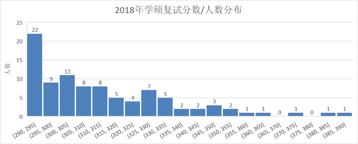

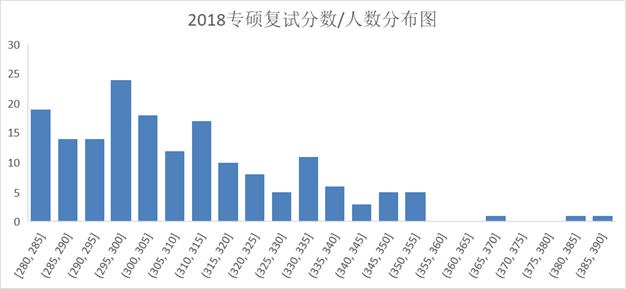

##### 1.4.2  2018年录取分数分布

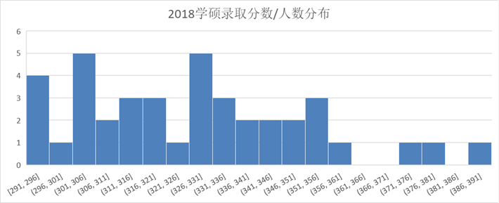

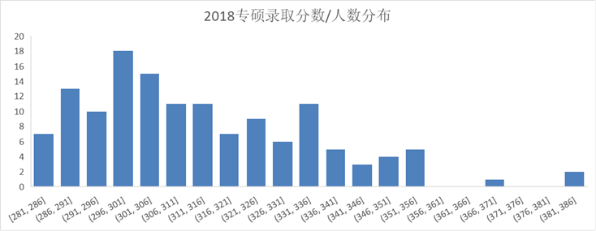

### 2  时间线

#### 2.1  2018年复试时间线

> 2.03 **公布初试成绩**          
> 3.16 **公布国家线**          
> 3.21 **公布复试线**          
> 3.26-3.29 **复试**         

#### 2.2  2017年复试时间线

> 2.17 **公布初试成绩**    
> 3.15 **公布国家线**         
> 3.16 **公布复试线**         
> 3.20-3.24 **复试**         

#### 2.3  2016年复试时间线

> 2.16 **公布初试成绩**    
> 3.11 **公布国家线**          
> 3.17 **公布复试线**         
> 3.28 **复试**         

### 3  临阵磨枪

> 往年复试成绩计算采用(50%*笔试+50%*复试)*50%+初试成绩*50%。其中笔试成绩必须大于等于60。

#### 3.1  练习

> 由于笔试主要为编程题目，这里笔者根据复习经验及群友推荐，推荐大家将杭电OJ第11页上的一百道题做一遍，从而快速拾起C/C++等编程基本要领。

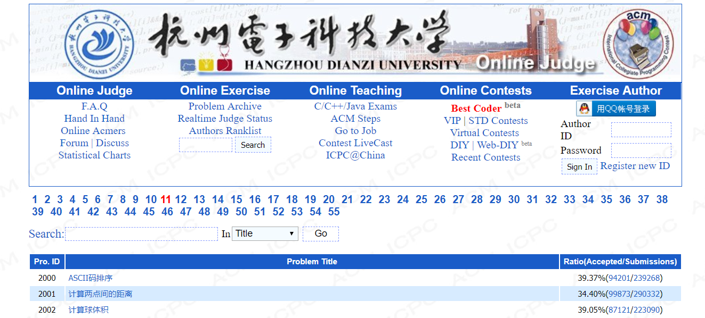

[杭州电子科技大学ACM OJ训练 Page 11](http://acm.hdu.edu.cn/listproblem.php?vol=11)

[ACM OJ训练 Page 11 2000-2099结题报告](Others/HDU 2000-2099 解题报告.CHM) from [xiandyun ](https://github.com/xiandyun )

#### 3.2  部分复试笔试真题及解析

> 本节内容摘自CSDN[逃离地球的小小呆博客](https://so.csdn.net/so/search/s.do?q=%E6%9D%AD%E7%94%B5&t=blog&u=gui951753)

- [杭州电子科技大学2006-2009年计算机硕士复试真题解析](https://blog.csdn.net/gui951753/article/details/79628591)
- [杭州电子科技大学2010年计算机硕士复试真题解析](https://blog.csdn.net/gui951753/article/details/79596114)
- [杭州电子科技大学2011年计算机硕士复试真题解析](https://blog.csdn.net/gui951753/article/details/79595161)
- [杭州电子科技大学2012年计算机硕士复试真题解析](https://blog.csdn.net/gui951753/article/details/79571748)
- [杭州电子科技大学2013年计算机硕士复试真题解析](https://blog.csdn.net/gui951753/article/details/79570967)
- [杭州电子科技大学2014年计算机硕士复试真题解析](https://blog.csdn.net/gui951753/article/details/79568584)
- [杭州电子科技大学2015年计算机硕士复试真题解析](https://blog.csdn.net/gui951753/article/details/79537583)
- [杭州电子科技大学2016年计算机硕士复试真题解析](https://blog.csdn.net/gui951753/article/details/79489097)
- [杭州电子科技大学2017年计算机硕士复试真题解析](https://blog.csdn.net/gui951753/article/details/79464579)

### 4  复试进行时

> 与官网保持同步更新。

#### 4.1  2018复试安排

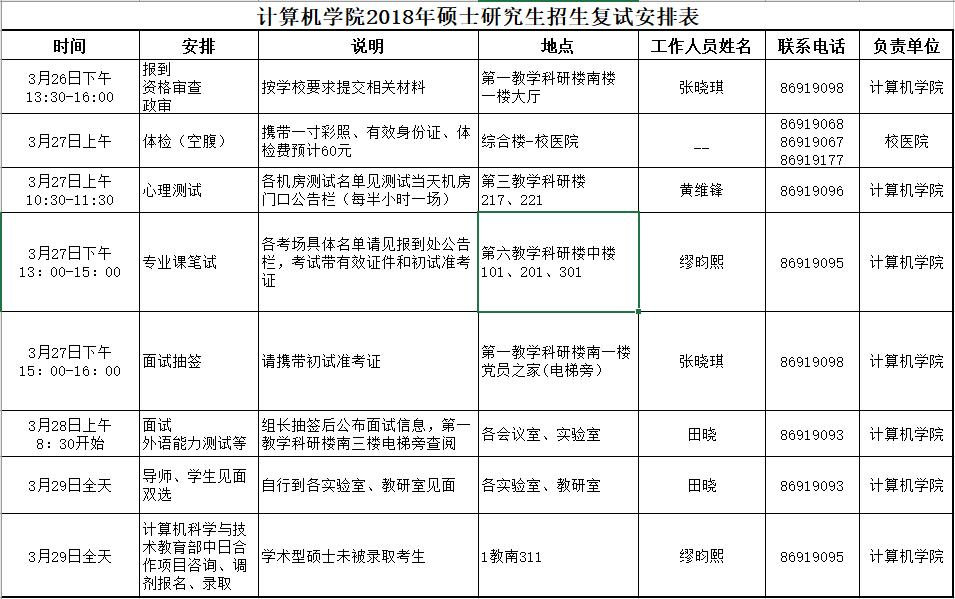

#### 4.2  复试准备资料

> 进入复试的考生需携带以下资料，[资料下载](http://grs.hdu.edu.cn/2018/0309/c1721a59188/page.htm)。

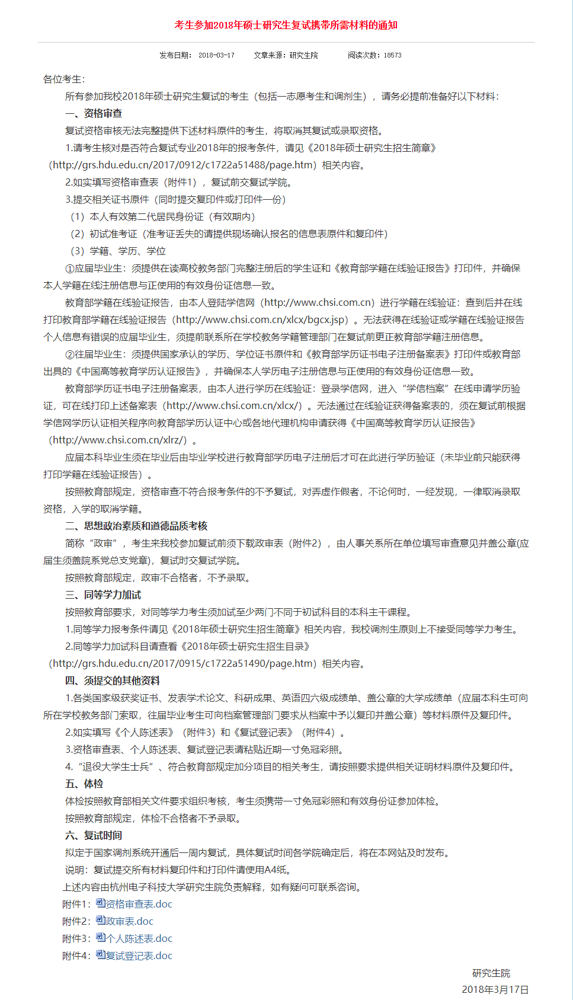

#### 4.3  复试录取办法

- [杭州电子科技大学2018年硕士研究生复试录取办法](Data2018/杭州电子科技大学2018年硕士研究生复试录取办法.pdf)

- [计算机学院硕士研究生复试录取工作补充说明](Data2018/计算机学院硕士研究生复试录取工作补充说明.pdf)

#### 4.4  杭电平面图

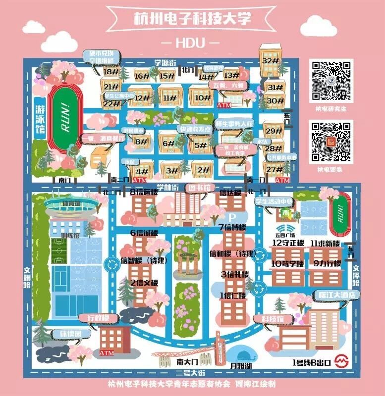

#### 4.5 实验室宣传栏

> 2018年实验室宣传文件，包括但不限于以下实验室。如果有遗漏，可按格式push上来或联系我更新。

- [2018物联网研究团队招新](Data2018/LabList/2018物联网研究团队招新.pdf)
- [“协同计算与海量数据处理”实验室招收研究生简介](Data2018/LabList/“协同计算与海量数据处理”实验室招收研究生简介.pdf)
- [127图形图像实验室简介](Data2018/LabList/127图形图像实验室简介.pdf)
- [532实验室陈小雕团队2018招新](Data2018/LabList/532实验室陈小雕团队2018招新.pdf)
- [城市计算与大数据团队招新手册](Data2018/LabList/城市计算与大数据团队招新手册.pdf)
- [欢迎报考智能信息处理与应用实验室](Data2018/LabList/欢迎报考智能信息处理与应用实验室.pdf)
- [认知与智能计算515实验室招生介绍2018](Data2018/LabList/认知与智能计算515实验室招生介绍2018.pdf)
- [图像处理实验室李黎老师团队介绍](Data2018/LabList/图像处理实验室李黎老师团队介绍.pdf)
- [吴国华老师团队硕士研究生招新](Data2018/LabList/吴国华老师团队硕士研究生招新.pdf)
- [物联网实验室-刘鹏课题组招生](Data2018/LabList/物联网实验室-刘鹏课题组招生.pdf)
- [云计算实验室宣传册pdf版](Data2018/LabList/云计算实验室宣传册pdf版.pdf)
- [智能计算与数据挖掘实验室招生宣传册](Data2018/LabList/智能计算与数据挖掘实验室招生宣传册.pdf)
- [智能可视建模与仿真研究团队2018招生](Data2018/LabList/智能可视建模与仿真研究团队2018招生.pdf)
- [智能软件工程实验室简介](Data2018/LabList/智能软件工程实验室简介.pdf)
- [智能与控制实验室招生宣传](Data2018/LabList/智能与控制实验室招生宣传.pdf)

### 不定期更新中。。。

## 后记

成功从来没有捷径可以走，但可以少走弯路。珍惜学习的时光，努力学习，不会错的。

希望这个页面能给你一些帮助。

Do something really cool and make the world a better place.

### 致谢

以上内容花了笔者较多精力整理，也离不开2018级计算机学院广大群友的支持。在他们的努力下，许多资料才得以放在这里。

感谢[刁总(Github:xiandyun)](https://github.com/xiandyun)的宝贵建议和文件支持。

---

**注**：1.本工程系闲暇之余整理的杭州电子科技大学计算机考研信息，所需信息来自官网及考研群，不定期更新，	希望为同学们收集资料节省一点时间、有所帮助。匆忙整理，错误在所难免，请联系并告诉我。

​	2.目前目录树尚未构思完毕，将按目录结构不定期更新，**可watch追踪进度，当前阶段可能更新较为频繁**。

​	3.如果有志同道合的朋友，可按照格式提交。本页面文件及资料收集自互联网，如侵犯了您的权益，请联系我删除。

​	4.如有问题，请[联系我](mailto:zhangty1996@163.com)。
