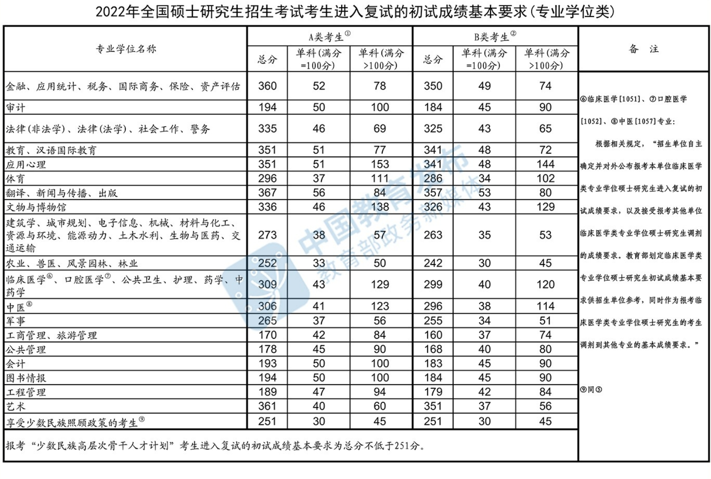
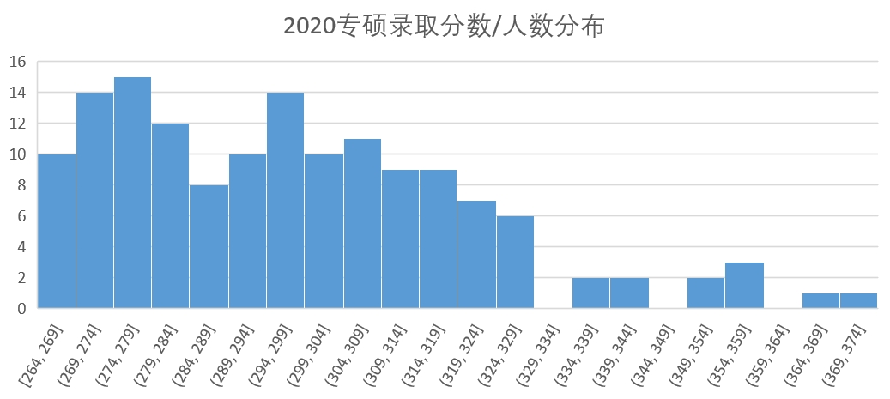

## 杭州电子科技大学计算机考研信息汇总


> 作者：[张天宇](https://tyzhang.top)	GitHub：[ztygalaxy](htpps://github.com/ztygalaxy) 	[字节跳动内推戳我直达](Others/BYTEDANCE.md)
>
> GitHub Pages:    [杭州电子科技大学计算机考研信息汇总](https://ztygalaxy.github.io/Hello_HDU)
>
> 适用报考范围：  **杭电计算机学院计算机相关专业**，不定期更新
>
> - <font color="#00BFFF">本系列只在GitHub不定期更新，其他平台非本人维护或停止维护，<font color="#00BFFF" style="font-weight: bold">转载请标明来源，谢谢</font>。</font>
> - <font color="#00BFFF">资料整理不易，<font color="#00BFFF" style="font-weight: bold">烦请您在Fork之前先Star，谢谢</font>。</font>

---

## 前言

什么他娘的精锐，老子打的就是精锐！—— 李云龙

## 目录

- [关于杭电](#关于杭电)
  - [1  杭电简介](#1--杭电简介)
  - [2  研究生奖助政策](#2--研究生奖助政策)
- [初试篇](#初试篇)
  - [1  杭电考研重要信息来源](#1--杭电考研重要信息来源)
  - [2  招生简章](#2--招生简章)
    - [2.1  杭州电子科技大学2023年硕士生招生简章](#21--杭州电子科技大学2023年硕士生招生简章)
    - [2.2  杭州电子科技大学2022年硕士生招生简章](#22--杭州电子科技大学2022年硕士生招生简章)
    - [2.3  中外合作办学2020年招生简章](#23--中外合作办学2020年招生简章)
  - [3  招生专业目录](#3--招生专业目录)
  - [4  报录比](#4--报录比)
    - [4.1  2023年](#41--2023年)
    - [4.2  2022年](#42--2022年)
    - [4.3  2021年](#43--2021年)
    - [4.4  2020年](#44--2020年)
    - [4.5  2019年](#45--2019年)
  - [5  考试大纲](#5--考试大纲)
    - [5.1  2023年考试大纲](#51--2023年考试大纲)
    - [5.2  2022年考试大纲](#52--2022年考试大纲)
    - [5.3  2021年考试大纲](#53--2021年考试大纲)
    - [5.4  2020年考试大纲](#54--2020年考试大纲)
    - [5.5  2019年考试大纲](#55--2019年考试大纲)
  - [6  专业课真题](#6--专业课真题)
    - [6.1  数据结构](#61--数据结构)
    - [6.2  组成原理](#62--组成原理)
    - [6.3  历年考点统计](#63--历年考点统计)
  - [7  2018级考研经验分享](#7--2018级考研经验分享)
- [复试篇](#复试篇)
  - [0 CCF CSP/PAT](#0-ccf-csppat)
  - [1  分数线](#1--分数线)
    - [1.1 分数线简介](#11-分数线简介)
    - [1.2  国家线](#12--国家线)
      - [1.2.1  2023年国家线](#121--2023年国家线)
      - [1.2.2  2022年国家线](#122--2022年国家线)
      - [1.2.3  2021年国家线](#123--2021年国家线)
      - [1.2.4  2020年国家线](#124--2020年国家线)
      - [1.2.5  2019年国家线](#125--2019年国家线)
    - [1.3  院线](#13--院线)
      - [1.3.1  2023年计算机学院院线](#131--2023年计算机学院院线)
      - [1.3.2  2022年计算机学院院线](#132--2022年计算机学院院线)
      - [1.3.3  2021年计算机学院院线](#133--2021年计算机学院院线)
      - [1.3.4  2020年计算机学院院线](#134--2020年计算机学院院线)
      - [1.3.5  2019年计算机学院院线](#135--2019年计算机学院院线)
    - [1.4 历年复试分数分析](#14-历年复试分数分析)
      - [1.4.1  2023年分数分布](#141--2023年分数分布)
      - [1.4.2  2022年分数分布](#142--2022年分数分布)
      - [1.4.3  2021年分数分布](#143--2021年分数分布)
      - [1.4.4  2020年分数分布](#144--2020年分数分布)
      - [1.4.5  2019年分数分布](#145--2019年分数分布)
  - [2  历史时间线](#2--历史时间线)
    - [2.1  2023年复试时间线](#21--2023年复试时间线)
    - [2.2  2022年复试时间线](#22--2022年复试时间线)
    - [2.3  2021年复试时间线](#23--2021年复试时间线)
    - [2.4  2020年复试时间线](#24--2020年复试时间线)
    - [2.5  2019年复试时间线](#25--2019年复试时间线)
  - [3  黎明之前](#3--黎明之前)
  - [4  临阵磨枪](#4--临阵磨枪)
    - [4.1  面试准备](#41--面试准备)
    - [4.2  笔试练习](#42--笔试练习)
    - [4.3  部分复试笔试真题及解析](#43--部分复试笔试真题及解析)
  - [5  复试进行时](#5--复试进行时)
    - [5.1  2023年成绩查询](#51--2023年成绩查询)
    - [5.2  计算机学院复试安排](#52--计算机学院复试安排)
    - [5.3  复试录取办法](#53--复试录取办法)
    - [5.4  杭电平面图](#54--杭电平面图)
  - [6  调剂](#6--调剂)
  - [7. 文件目录结构](#7-文件目录结构)
  - [不定期更新。。。](#不定期更新)
- [后记](#后记)
  - [致谢](#致谢)
  - [反馈](#反馈)

---


##  关于杭电

###  1  杭电简介

​    杭州电子科技大学是一所电子信息特色突岀，经管学科优势明显，工、理、经、管、文、法、艺等多学科相互渗透的高水平教学硏究型大学。

​    学校始创于1956年杭州航空工业财经学校，1980年改建为杭州电子工业学院，2004年更名为杭州电子科技大学，2007年成为浙江省与国防科学技术工业委员会共建高校，2015年成为首批浙江省重点建设高校。截至2018年4月，学校有专任教师1600余人，其中正高职称290余人， 具有博士学位教师1100余人。拥有院士3名，共享院士5名，浙江省特级专家2人、国家级有突出贡献中青年专家3人、国家“千人计划”特聘专家8人、青年千人2人，国家杰出青年基金获得者4人、国家社科重大项目首席专家2人，国家新世纪百千万工程人才4人、长江青年学者2人，优秀青年科学基金获得者2人、教育部新世纪优秀人才支持计划13人、浙江省突出贡献中青年专家6人、浙江省“千人计划”特聘专家18人、浙江省“钱江学者”特聘教授15人。设有国家“111计划”学科创新引智基地1个、省级院士专家工作站1个。

​    在教育部学位与研究生教育发展中心公布的全国第四轮学科评估结果中,我校电子科学与技术、控制科学与工程、计算机科学与技术3个学科获得B+，位居全国高校前20%，表现超过部分重点名校。学校秉承“笃学力行、守正求新”之校训，以电子信息和经济管理两大专业类为主体，形成了具备“信息科技”和“创新实践能力”竞争优势的办学特色，是我国信息技术领域、国防现代化建设和浙江省高新技术人才培养、科学研究及成果转化的重要基地，被誉为“中国IT企业家沃土”和“卓越会计师摇篮”。

​    [更多介绍](https://baike.baidu.com/item/%E6%9D%AD%E5%B7%9E%E7%94%B5%E5%AD%90%E7%A7%91%E6%8A%80%E5%A4%A7%E5%AD%A6)

###  2  研究生奖助政策

​    根据囯家和浙江省政策，从2014年秋季开始，硕士研究生新生报到注册后，可获得如下奖助：

​    1.国家助学金：每生每年6000元；

​    2.学业奖学金：每生每年最低8000元，最高12000元；

​    3.学生通过努力可以获得国家奖学金20000元，华为奖学金5000元等奖学金。此外，学校提供助教、助管、助研机会，获得相应津贴。

​    4.需申请助学贷款的可见[《杭州电子科技大学研究生新生入学绿色通道申请办法》](http://grs.hdu.edu.cn/2014/0530/c1752a52414/page.htm)

## 初试篇

### 1  杭电考研重要信息来源

- [杭州电子科技大学研究生院](http://grs.hdu.edu.cn)
- [杭州电子科技大学计算机学院](http://computer.hdu.edu.cn )
- [热点问答!杭州电子科技大学2021年硕士研究生招生热点问题答疑](http://grs.hdu.edu.cn/2021/0303/c1721a132660/page.htm)
- 杭电研究生招生和研招网微信公众号
- 受网络环境影响，GitHub可能会出现图片加载缓慢或加载失败的情况，你可以点击[这](https://pic.tyzhang.top/images/2019/11/16/1573884016.png)扫描二维码在手机打开。


### 2  招生简章

#### 2.1  杭州电子科技大学2023年硕士生招生简章

- [杭州电子科技大学2023年硕士生招生简章](https://grs.hdu.edu.cn/2022/0915/c1721a156749/page.htm)

#### 2.2  杭州电子科技大学2022年硕士生招生简章

- [杭州电子科技大学2022年硕士生招生简章](https://grs.hdu.edu.cn/2021/0915/c1721a136904/page.htm)

#### 2.3  中外合作办学2020年招生简章

- [杭州电子科技大学圣光机联合学院2020年硕士研究生招生简章[专硕]](Data2020/杭州电子科技大学圣光机联合学院2020年硕士研究生招生简章.pdf)

- [杭州电子科技大学与日本山梨大学合作培养2020年计算机科学与技术硕士研究生招生简章[学硕]](Data2020/杭州电子科技大学与日本山梨大学合作培养2020年计算机科学与技术硕士研究生招生简章.pdf)


### 3  招生专业目录

> **简介**：招生专业、人数、初试科目等信息。


### 4  报录比

> **简介**：历年各专业的具体报录信息和往年的考试均分等信息。供考研学子评估考研难度，为择校提供参考数据。列分别为：报名人数/上线人数/复试人数/最高分/最低分/平均分。


#### 4.1  2023年

TODO: 暂无数据

#### 4.2  2022年


[详情](Data2022/2022年硕士研究生报考上线录取情况.pdf)

#### 4.3  2021年


[详情](Data2021/2021年硕士研究生报考上线录取情况.pdf)

#### 4.4  2020年


[详情](Data2020/2020年硕士研究生报考上线录取情况.pdf)

#### 4.5  2019年


[详情](Data2019/2019年硕士研究生报考上线录取情况.pdf)

### 5  考试大纲

> **简介**： <font color="#FF0000" style="font-weight: bold">根据研究生培养需要，计算机学院2021年硕士研究生入学考试所有专业初试科目业务课二由“857计算机专业综合”拟调整为 “408计算机学科专业基础综合”，具体以学校发布的招生目录相关内容为准，特此说明。</font>
>
> [计算机学院关于拟调整硕士研究生入学考试初试科目的情况说明](http://computer.hdu.edu.cn/2020/0715/c1377a110771/page.htm)
>
> 因专业课调整，本项目初试篇中“考试大纲”和“专业课真题”栏目不再准确，请考生按照408相关内容复习准备。

#### 5.1  2023年考试大纲
- 408计算机学科专业基础综合

#### 5.2  2022年考试大纲
- 408计算机学科专业基础综合

#### 5.3  2021年考试大纲
- 408计算机学科专业基础综合

#### 5.4  2020年考试大纲

- [2020年857计算机专业综合考试大纲](Data2020/857计算机专业综合.pdf)

#### 5.5  2019年考试大纲

- [2019年856数据结构与组成原理考试大纲](Data2019/856数据结构与组成原理.pdf)


### 6  专业课真题

> **简介**：因专业课调整，本项目初试篇中“考试大纲”和“专业课真题”栏目不再准确，请考生按照408相关内容复习准备。

#### 6.1  数据结构

[2020.12](https://github.com/ztygalaxy/Hello_HDU/tree/master/Data2020/计算机专业综合)  [2019.12](https://github.com/ztygalaxy/Hello_HDU/tree/master/Data2018/数据结构与组成原理)  [2018.12](https://github.com/ztygalaxy/Hello_HDU/tree/master/Data2018/数据结构与组成原理)  [2017.12](https://github.com/ztygalaxy/Hello_HDU/tree/master/Data2017/数据结构)  [2016.12](https://github.com/ztygalaxy/Hello_HDU/tree/master/Data2016/数据结构)

[2015.12](https://github.com/ztygalaxy/Hello_HDU/tree/master/Data2015/数据结构)  [2014.12](https://github.com/ztygalaxy/Hello_HDU/tree/master/Data2014/数据结构)  [2013.12](https://github.com/ztygalaxy/Hello_HDU/tree/master/Data2013/数据结构)  [2012.12](https://github.com/ztygalaxy/Hello_HDU/tree/master/Data2012/数据结构)  [2011.12](https://github.com/ztygalaxy/Hello_HDU/tree/master/Data2011/数据结构)

#### 6.2  组成原理

[2017.12](https://github.com/ztygalaxy/Hello_HDU/tree/master/Data2017/组成原理)  [2016.12](https://github.com/ztygalaxy/Hello_HDU/tree/master/Data2016/组成原理)  [2015.12](https://github.com/ztygalaxy/Hello_HDU/tree/master/Data2015/组成原理)  [2014.12](https://github.com/ztygalaxy/Hello_HDU/tree/master/Data2014/组成原理)

[2013.12](https://github.com/ztygalaxy/Hello_HDU/tree/master/Data2013/计算机组成原理)  [2012.12](https://github.com/ztygalaxy/Hello_HDU/tree/master/Data2012/计算机组成原理)  [2011.12](https://github.com/ztygalaxy/Hello_HDU/tree/master/Data2011/计算机组成原理)

#### 6.3  历年考点统计

> 本数据来自 19HDU计算机考研群


### 7  2018级考研经验分享

> **简介**：本栏数据为2018级录取结束后，新生群主管理员等邀请得分高手撰写。作者主要是初试高分选手、复试佼佼者及有特点的选手。

- [三跨考研复试经验](https://github.com/HanochShi/HDU_Interview) by [史航HanochShi](https://github.com/HanochShi)

- [18砥砺前行19金榜题名](https://github.com/ztygalaxy/Hello_HDU/blob/master/Others/%E7%BB%8F%E9%AA%8C/18%E7%A0%A5%E7%A0%BA%E5%89%8D%E8%A1%8C19%E9%87%91%E6%A6%9C%E9%A2%98%E5%90%8D.pdf)

- [18杭电计算机考研初试状元经验分享](https://github.com/ztygalaxy/Hello_HDU/blob/master/Others/%E7%BB%8F%E9%AA%8C/18%E6%9D%AD%E7%94%B5%E8%AE%A1%E7%AE%97%E6%9C%BA%E8%80%83%E7%A0%94%E5%88%9D%E8%AF%95%E7%8A%B6%E5%85%83%E7%BB%8F%E9%AA%8C%E5%88%86%E4%BA%AB.pdf)

- [18计算机专业课复习心得](https://github.com/ztygalaxy/Hello_HDU/blob/master/Others/%E7%BB%8F%E9%AA%8C/18%E8%AE%A1%E7%AE%97%E6%9C%BA%E4%B8%93%E4%B8%9A%E8%AF%BE%E5%A4%8D%E4%B9%A0%E5%BF%83%E5%BE%97.pdf)

- [19届复习建议——必看！](https://github.com/ztygalaxy/Hello_HDU/blob/master/Others/%E7%BB%8F%E9%AA%8C/19%E5%B1%8A%E5%A4%8D%E4%B9%A0%E5%BB%BA%E8%AE%AE%E2%80%94%E2%80%94%E5%BF%85%E7%9C%8B%EF%BC%81.pdf)

- [2018复试经验](https://github.com/ztygalaxy/Hello_HDU/blob/master/Others/%E7%BB%8F%E9%AA%8C/2018%E5%A4%8D%E8%AF%95%E7%BB%8F%E9%AA%8C.pdf)

- [不考400分，咱先上国家线！](https://github.com/ztygalaxy/Hello_HDU/blob/master/Others/%E7%BB%8F%E9%AA%8C/%E4%B8%8D%E8%80%83400%E5%88%86%EF%BC%8C%E5%92%B1%E5%85%88%E4%B8%8A%E5%9B%BD%E5%AE%B6%E7%BA%BF%EF%BC%81.pdf)

- [复试大佬经验谈](https://github.com/ztygalaxy/Hello_HDU/blob/master/Others/%E7%BB%8F%E9%AA%8C/%E5%A4%8D%E8%AF%95%E5%A4%A7%E4%BD%AC%E7%BB%8F%E9%AA%8C%E8%B0%88.pdf)

- [杭电学硕大佬复试经验](https://github.com/ztygalaxy/Hello_HDU/blob/master/Others/%E7%BB%8F%E9%AA%8C/%E6%9D%AD%E7%94%B5%E5%AD%A6%E7%A1%95%E5%A4%A7%E4%BD%AC%E5%A4%8D%E8%AF%95%E7%BB%8F%E9%AA%8C.pdf)

- [跨考+英语+面试口语经验](https://github.com/ztygalaxy/Hello_HDU/blob/master/Others/%E7%BB%8F%E9%AA%8C/%E8%B7%A8%E8%80%83%2B%E8%8B%B1%E8%AF%AD%2B%E9%9D%A2%E8%AF%95%E5%8F%A3%E8%AF%AD%E7%BB%8F%E9%AA%8C.pdf)

- [浅谈杭电计算机考研复习策略](https://github.com/ztygalaxy/Hello_HDU/blob/master/Others/%E7%BB%8F%E9%AA%8C/%E6%B5%85%E8%B0%88%E6%9D%AD%E7%94%B5%E8%AE%A1%E7%AE%97%E6%9C%BA%E8%80%83%E7%A0%94%E5%A4%8D%E4%B9%A0%E7%AD%96%E7%95%A5.pdf)

- [学硕第二名的经验](https://github.com/ztygalaxy/Hello_HDU/blob/master/Others/%E7%BB%8F%E9%AA%8C/%E5%AD%A6%E7%A1%95%E7%AC%AC%E4%BA%8C%E5%90%8D%E7%9A%84%E7%BB%8F%E9%AA%8C.txt)

- [一份来自苦哈哈专业跨考狗的胡吹](https://github.com/ztygalaxy/Hello_HDU/blob/master/Others/%E7%BB%8F%E9%AA%8C/%E4%B8%80%E4%BB%BD%E6%9D%A5%E8%87%AA%E8%8B%A6%E5%93%88%E5%93%88%E4%B8%93%E4%B8%9A%E8%B7%A8%E8%80%83%E7%8B%97%E7%9A%84%E8%83%A1%E5%90%B9.pdf)

- [政治复习经验](https://github.com/ztygalaxy/Hello_HDU/blob/master/Others/%E7%BB%8F%E9%AA%8C/%E6%94%BF%E6%B2%BB%E5%A4%8D%E4%B9%A0%E7%BB%8F%E9%AA%8C.pdf)

## 复试篇

> “往者不可谏,来者犹可追”

### 0 CCF CSP/PAT

[编程能力参考](https://computer.hdu.edu.cn/2022/0511/c6769a154141/page.htm)


### 1  分数线

#### 1.1 分数线简介

杭电的分数线可以分为两种：国家线和院线
一般情况下：**国家线**≤**院线**

> `国家线`：国家线是教育部统一划定的复试最低控制分数线，低于国家线的考生无法参加研究生复试。
>  `院线`：院线是决定考生是否有资格参加本院所报考专业复试的最低控制分数线。低于院线的原报考生不能参加本院报考专业的复试。
>   详细要求请留意当年学院公布的复试细则，以官网为准。

#### 1.2  国家线

##### 1.2.1  2023年国家线


##### 1.2.2  2022年国家线




##### 1.2.3  2021年国家线


##### 1.2.4  2020年国家线


##### 1.2.5  2019年国家线


#### 1.3  院线

##### 1.3.1  2023年计算机学院院线

> - 学硕复试线：**330**
> - 专硕复试线：**300**
> - 复试名单([下载](Data2023/复试/2023年硕士研究生招生考试一志愿考生复试名单.pdf))
> - 录取名单(不同专业代码在不同xlsx,且存在补录情况,请到对应目录查看)

##### 1.3.2  2022年计算机学院院线

> - 学硕复试线：**300**
> - 专硕复试线：**315**
> - 复试名单([下载](Data2022/复试/2022年硕士研究生招生考试一志愿考生复试名单.pdf))
> - 录取名单(不同专业代码在不同xlsx,且存在补录情况,请到对应目录查看)

##### 1.3.3  2021年计算机学院院线

> - 学硕复试线：**315**
> - 专硕复试线：**295**
> - 复试名单([下载](Data2021/复试/2021年硕士研究生一志愿复试名单.pdf))
> - 录取名单(不同专业代码在不同xlsx,且存在补录情况,请到对应目录查看)

##### 1.3.4  2020年计算机学院院线

> - 学硕复试线：**275**
> - 专硕复试线：**264**（国家线）
> - 复试名单([下载](Data2020/2020年复试名单.pdf))
> - 录取名单([下载](Data2020/2020年录取名单.xlsx))

##### 1.3.5  2019年计算机学院院线

> - 学硕复试线：**270**（国家线）
> - 专硕复试线：**280**
> - 复试名单([下载](Data2019/2019年复试名单.xlsx))
> - 录取名单([下载](Data2019/2019年录取名单.xlsx))

#### 1.4 历年复试分数分析

> 这里对近几年考生分数做分析，以便使考生对自己所处段位有较好的评估。最高分平均分等请前往报录比查看。

##### 1.4.1  2023年分数分布


##### 1.4.2  2022年分数分布


##### 1.4.3  2021年分数分布


##### 1.4.4  2020年分数分布




##### 1.4.5  2019年分数分布


### 2  历史时间线


####  2.1  2023年复试时间线

> 2.21 **公布初试成绩**           
> 3.10 **公布国家线**          
> 3.26 **公布复试线**     
> 3.31-4.1 **线下复试**

####  2.2  2022年复试时间线

> 2.21 **公布初试成绩**   
> 3.11 **公布国家线**  
> 3.26 **公布复试线**     
> 4.3 **网络复试**  

####  2.3  2021年复试时间线

> 2.26 **公布初试成绩**           
> 3.15 **公布国家线**          
> 3.20 **公布复试线**          
> 3.27 **网络复试**                       

####  2.4  2020年复试时间线

> 2.20 **公布初试成绩**           
> 4.15 **公布国家线**          
> 5.5 **公布复试线**          
> 5.16 **网络复试**                       

####  2.5  2019年复试时间线

> 2.15 **公布初试成绩**           
> 3.15 **公布国家线**          
> 3.19 **公布复试线**          
> 3.25-3.29 **复试**        

### 3  黎明之前

​    2023年杭电复试采用“初试 * 60% + 复试 * 40% = 总成绩”的模式。

​    复试前应做好哪些准备工作？

-  处理好本科学校的事务，提前几天来杭电，方便参加各种实验室面试。
- 邮件联系心仪的导师或者实验室，参加实验室面试。
- 精心准备一份简历

### 4  临阵磨枪

> 2023年复试成绩计算采用 初试成绩 * 60% + (笔试 * 30% + 面试 * 60% + 外语能力 * 10%) * 40%。综合成绩必须大于等于60。

#### 4.1  面试准备

​    杭电复试面试采用分组形式，一组大概二十人不等，视人数而定，每人五到十分钟。面试内容包含英语自我介绍、本科课程提问、闲聊等等。因此建议每位考生准备一份干货满满的简历、一份简单熟练的英语自我介绍，有时间的话最好对本科重点课程，特别是刚学完的课程的课本大概浏览回顾一下。简历包含自己的个人信息、考研情况、本科成绩单（必须）、项目科研经历等一切能证明自己与众不同的都可，复印件等佐证材料附后。相关经验参见[2018级经验分享](#7--2018考研经验分享)。

​    [简历参考](Others/简历模板.docx)

#### 4.2  笔试练习

> 由于笔试主要为编程题目，远程复试期间为代码填空。这里笔者根据复习经验及群友推荐，推荐大家将杭电OJ第11页上的一百道题做一遍，从而快速拾起C/C++等编程基本要领。


[杭州电子科技大学ACM OJ训练 Page 11](http://acm.hdu.edu.cn/listproblem.php?vol=11)

[ACM OJ训练 Page 11 2000-2099解题报告](Others/HDU 2000-2099 解题报告.CHM) from [xiandyun ](https://github.com/xiandyun )

#### 4.3  部分复试笔试真题及解析

> 本节内容摘自CSDN[逃离地球的小小呆博客](https://so.csdn.net/so/search/s.do?q=%E6%9D%AD%E7%94%B5&t=blog&u=gui951753) 等，仅作题目收集，未对答案正确与否进行核验。年份指当届考生复试题目，即2019年复试真题为2019届考生在2018年12月份的考试题目。

- [杭州电子科技大学2006-2009年计算机硕士复试真题解析](https://blog.csdn.net/gui951753/article/details/79628591)
- [杭州电子科技大学2010年计算机硕士复试真题解析](https://blog.csdn.net/gui951753/article/details/79596114)
- [杭州电子科技大学2011年计算机硕士复试真题解析](https://blog.csdn.net/gui951753/article/details/79595161)
- [杭州电子科技大学2012年计算机硕士复试真题解析](https://blog.csdn.net/gui951753/article/details/79571748)
- [杭州电子科技大学2013年计算机硕士复试真题解析](https://blog.csdn.net/gui951753/article/details/79570967)
- [杭州电子科技大学2014年计算机硕士复试真题解析](https://blog.csdn.net/gui951753/article/details/79568584)
- [杭州电子科技大学2015年计算机硕士复试真题解析](https://blog.csdn.net/gui951753/article/details/79537583)
- [杭州电子科技大学2016年计算机硕士复试真题解析](https://blog.csdn.net/gui951753/article/details/79489097)
- [杭州电子科技大学2017年计算机硕士复试真题解析](https://blog.csdn.net/gui951753/article/details/79464579)
- [杭州电子科技大学2018年计算机硕士复试部分真题解析](https://blog.csdn.net/loi_feather/article/details/52838977)
- [杭州电子科技大学2019年计算机硕士复试部分真题解析](https://blog.csdn.net/weixin_42044546/article/details/88876958)

### 5  复试进行时

#### 5.1  2023年成绩查询

根据教育部和浙江省教育考试院关于硕士研究生招生考试工作的统一部署和要求，杭州电子科技大学2023年硕士研究生招生考试初试成绩**2月21日14:00**开始向社会公布，届时考生可登录相关网址查询本人成绩。

#### 5.2  计算机学院复试安排

- [计算机学院2023年硕士研究生招生复试工作实施细则](https://computer.hdu.edu.cn/2023/0326/c6738a243109/page.htm)

#### 5.3  复试录取办法

- [杭州电子科技大学2023年硕士研究生复试录取办法](Data2023/复试/计算机学院2023年硕士研究生招生复试录取工作实施细则.pdf)

#### 5.4  杭电平面图

> 杭电平面图，计算机学院位于“1 信仁楼”即第一教学楼位置。


### 6  调剂

​    关于调剂事宜，需要调剂的考生请在国家复试线公布后，关注我校有关调剂通知，并直接登录“中国研究生招生信息网<http://yz.chsi.com.cn/>”，根据各学院的缺额情况、调剂要求，填报调剂志愿。具体情况，也可在国家线公布后联系各学院咨询，联系方式详见5.1中参考链接。 


### 7. 文件目录结构
```
Hello_HDU/
├── DataXXXX/    # XXXX代表年份,例如 Data2023/
│   ├── imgs/    # 专门存放图片的目录(图片会在REAME.md展示)
│   │   ├── XXXX国家线学硕.png
│   │   ├── XXXX国家线专硕.png
|   |   ├── XXXX年招生专业目录.png
|   |   └── XXXX分数分布.png    # 图片生成代码在 Generate/ 下
│   ├── tmp/    # 编写说明文档时，产生的临时文件，可以不看
│   ├── 复试/    # 复试名单
│   │   ├── XXXX年硕士研究生招生考试一志愿考生复试名单.pdf
│   │   └── 计算机学院XXXX年硕士研究生招生复试录取工作实施细则.pdf
│   ├── 待录取/    # 待录取名单
│   ├── XXXX年硕士研究生报考上线录取情况.pdf
│   └── XXXX年硕士研究生招生专业目录.xls
├── Generate/    # 用于生成 分数/人数分布 图
│   ├── csv_data/    # csv数据文件
│   └── score_distribution.py # 生成图片代码
└── Others/
    ├── Contributors/
    ├── LabList/
    ├── 复试笔试真题/
    ├── 经验/
    ├── ACM.png
    ├── BYTEDANCE.md
    ├── HDU 2000-2099 解题报告.CHM
    ├── qcode_zfb.jpg
    ├── qrcode_zdplxs.jpg
    ├── qrcode_zdplxs_word
    ├── qrcode_zs.png
    ├── star.png
    ├── star1.png
    ├── 杭电平面图.jpg
    ├── 简历模板.docx
    └── 组成原理统计.png
```
### 不定期更新。。。

## 后记

​    成功从来没有捷径可以走，但可以少走弯路。珍惜学习的时光，努力学习，不会错的。

​    希望这个页面能给你一些帮助。

​    **Do something really cool and make the world a better place.**

### 致谢

​    以上内容花了本人较多精力整理，同时也离不开2018级计算机学院群友们的支持。在我们的共同努力下，许多资料才得以放在这里。不仅如此，在项目的日常维护中，也收到了众多研友的感谢与资讯信息，在此一并表示感谢。

​    如果您觉得有所帮助的话，可以给我一颗Star♥或者请我喝杯[☕](Others/qcode_zfb.jpg)，谢谢。

​    **欢迎加入杭州电子科技大学计算机考研官方交流群：561072531，256723483。**

​	[字节跳动内推戳我直达](Others/BYTEDANCE.md)

贡献者

  [](https://github.com/ztygalaxy)  [](https://github.com/Felon03 )  [](https://github.com/xiandyun)
  [](https://github.com/moblackwhite)

Star的朋友们

  [](https://github.com/ztygalaxy/Hello_HDU/stargazers)

### 反馈

​	如果您在浏览过程中发现了错误或者有好的建议，请在Issue中提出，或者[与我联系 E-Mail:zhangty1996@163.com](mailto:zhangty1996@163.com)。

---

​    如果您不嫌烦的话，还可以关注我的个人订阅号，张大炮来巡山，浏览我的[博客](https://tyzhang.top)。


